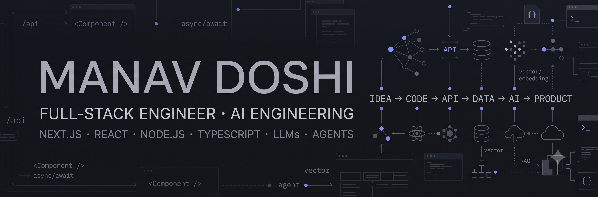

  

# Hey, I'm Manav 👋

### Software Developer · Full-Stack · AI Engineering

I build and ship **production-grade web applications** and enjoy turning ideas into working products — from frontend experiences and backend APIs to AI-powered workflows.

Currently exploring the intersection of **Full-Stack Development, Generative AI, and Agentic Systems**.

---

### ⚡ What I work with

**Frontend**
`React` · `Next.js` · `TypeScript` · `JavaScript` · `Tailwind CSS` · `Redux` · `Zustand`

**Backend**
`Node.js` · `Express.js` · `NestJS` · `REST APIs` · `MySQL` · `PostgreSQL` · `MongoDB`

**AI / GenAI**
`LLM APIs` · `LangChain` · `RAG` · `Vector Databases` · `Agentic AI` · `MCP` · `Prompt Engineering`

**Cloud & DevOps**
`AWS` · `Docker` · `CI/CD` · `Nginx` · `Vercel`

---

### 🚀 What I'm building

* 🧠 Exploring **AI agents, RAG, MCP and tool-calling**
* ⚡ Building full-stack applications with **Next.js + Node.js**
* 🛠️ Experimenting with **LLM-powered developer workflows**
* 💡 Building products and ideas around **AI + fintech + loyalty**

---

### 🧩 Featured Projects

Coming soon — I'm currently polishing my best projects to make them easier to explore.

---

### 📊 GitHub

---

### 🤝 Let's connect

---

> Build. Learn. Ship. Repeat.
